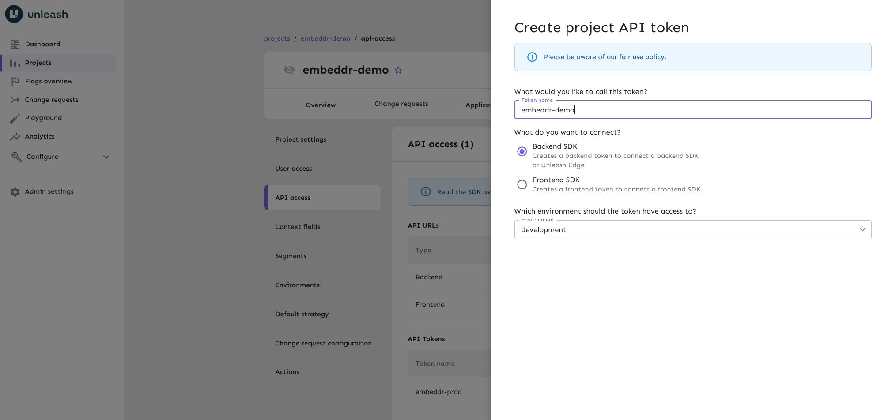
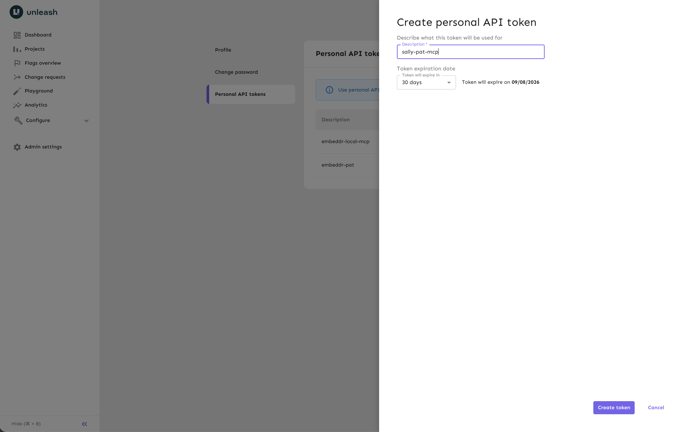
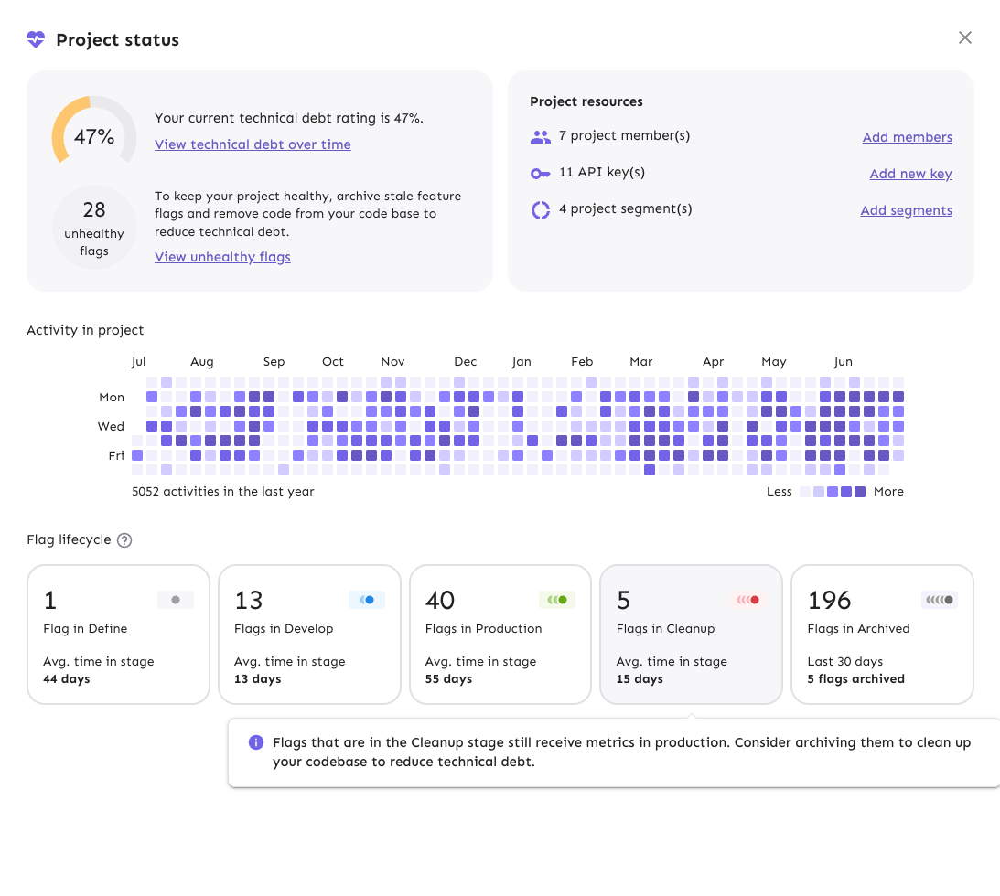

# Workshop workbook: Runtime Control with AI

This workbook takes you through the whole workshop: setting up, building a
feature with your AI assistant, and controlling that feature at runtime.

Work at your own pace. Each part ends with a checkpoint that tells you how to
verify your progress before moving on. If you get stuck, raise a hand, ask your
neighbor, or use the fallback commands in [FALLBACKS.md](FALLBACKS.md). Every
assistant-driven step has a fallback command, so a misbehaving assistant never
blocks you.

## What you are going to do

Embeddr is a dating app for AI agents. It has a React frontend and a Node backend,
with feature flags evaluated on the backend through Unleash.

As part of this workshop, you will:

1. Set up: run the Embeddr app, connect it to Unleash, and connect your AI assistant through the [Unleash MCP server](https://docs.getunleash.io/integrate/mcp).
2. Ask your assistant to build a new feature, wrapped in a feature flag from
   the start.
3. Roll the feature out, then switch it off at runtime while the app keeps
   running. No redeploy.
4. Optionally, retire the flag when you are done with it.


## Part 1: set up

You need a laptop with Node.js 22 or later, git, and an AI coding assistant
that supports MCP.

### Clone the repo

1. Clone the workshop repo and step into it:

   ```bash
   git clone https://github.com/Unleash/embeddr-workshop.git
   cd embeddr-workshop
   ```

2. Open the folder in your preferred editor. You will edit two files during
   setup and your assistant works in this folder in Part 2.

### Sign in and find your project

1. Check your email for the invitation to the workshop Unleash instance and
   sign in.
2. In the Unleash UI, open **Projects** and find the project named after you:
   first name, last initial, for example `Melinda F`.

### Copy the env file

The backend reads its configuration from `server/.env`.

Copy the example file:

```bash
cp server/.env.example server/.env
```

### Create the backend token and configure the app

The app's backend evaluates flags with its own token, scoped to your project.

1. In the Unleash UI, go to your project > **Settings**, then **API access**, then
   **New API token**.
2. Choose the **Backend** token type.
3. Scope it to the `development` environment, and create it.



4. Copy the token. It looks like `your-project-id:development.xxxx`.
5. Fill in `server/.env`: paste the token into `UNLEASH_CLIENT_TOKEN`.
6. The same view in the Unleash UI also shows the API URLs for the instance.
   Copy the one ending in `/api`.
7. Paste it into `UNLEASH_API_URL`.

### Run the app

1. From the repo root, run:

   ```bash
   npm install
   npm run dev
   ```

2. Open `http://localhost:5173`. You should see profile cards of AI agents
   looking for love. The backend terminal should log
   `unleash: flags synchronized`, with no warnings about missing variables.

### Create your PAT and connect your AI assistant

To ensure a quick setup, we'll be using the
[remote MCP server](https://docs.getunleash.io/integrate/mcp): an endpoint
hosted by the workshop instance itself. To authenticate with it, create a
personal access token (PAT).

1. In the Unleash UI, select your profile icon, then **Profile settings**,
   then **Personal API tokens**, then **New token**. Create it and copy the
   token. It starts with `user:`.



2. Open the MCP config file for your assistant. The repo ships one per tool:

   | Assistant | Config file |
   |-----------|-------------|
   | Claude Code | `.mcp.json` |
   | Cursor | `.cursor/mcp.json` |
   | VS Code Copilot | `.vscode/mcp.json` |
   | OpenCode | `opencode.json` |
   | Codex | `.codex/config.toml` |
   | Gemini CLI | `.gemini/settings.json` |

3. Replace `YOUR_PAT` with the token you just created, keeping the `Bearer `
   prefix.
4. Replace `YOUR_INSTANCE`. This is the same URL you
   pasted into `UNLEASH_API_URL` in `server/.env`, just with `/admin/mcp`
   added to the end.
5. Restart your assistant so it picks up the config.

Do not commit the file after filling it in.

**Checkpoint 1.** The app renders at `localhost:5173` and the backend logged
`unleash: flags synchronized` with no warnings about missing variables. Your assistant is connected to the MCP server.

**About the local MCP server.** This workshop uses the remote MCP endpoint
hosted by the instance, so there is nothing to install. You can also run the
[Unleash MCP server](https://docs.getunleash.io/integrate/mcp) locally. Check out our docs for [full example setups](https://docs.getunleash.io/integrate/claude-code).

### If something is off

| Symptom | Likely cause |
|---------|--------------|
| Backend warns about missing variables | `server/.env` is empty or not filled in |
| Flags never sync | Backend token scoped to the wrong project or environment, or the backend URL is missing its `/api` |

## Part 2: build a feature

Embeddr wants to monetize. The free tier shows six matches; Embeddr Premium
promises the rest of the embedding space, for a price. Product is excited.
Finance is more excited. Let's see.

1. Give your assistant this prompt:

   ```text
   Add an embeddr premium upsell that shows a premium call to action in the
   match grid inviting the user to subscribe to see more models.
   ```

2. Watch what the assistant does. Notice the prompt never says the words
   feature flag. Deciding that this change needs one is the assistant's job.
   Expect it to:

   - evaluate the change through the MCP server and decide it needs a
     release flag
   - create the flag in your project, suffixed with your project ID, like
     `premium-upsell-melinda-f`
   - write the backend code that serves the call to action only when the
     flag is on, and the frontend code that renders it

   The suffix is there because flag names are unique across the shared
   instance. Our repo guidance sets that convention, but you can also enforce
   naming per project inside Unleash.

3. Verify its work in the Unleash UI: your project should show a premium
   flag, turned off.

4. Look at the app. No call to action anywhere yet. The code is there. The
   feature is not released.

**Checkpoint 2.** A flag named like `premium-upsell-<your-project-id>`
exists in your project in the Unleash UI, turned off, and the app shows no
premium call to action.

**If something is off:**

| Symptom | Likely cause |
|---------|--------------|
| The assistant shows no Unleash tools | The MCP config was not picked up. Check the config file for your assistant, then restart it. The endpoint URL must end in `/api/admin/mcp`, with only `YOUR_INSTANCE` replaced |
| Tool calls fail with `401 Unauthorized` | Wrong token in the MCP config. It needs the PAT starting with `user:` after the word `Bearer`, not the backend token |
| The assistant cannot decide where to create the flag | Not a failure. Tell it your project ID |

**If your assistant misbehaves:** create the flag yourself with the
create-flag command in FALLBACKS.md, then ask the assistant to write only
the code. If the code is wrong, ask it to fix the specific problem you see.
You do not need to start over.

## Part 3: release it, then kill it

Time to turn the flag on.

1. In the Unleash UI, open your premium flag. In the development
   environment, add a gradual rollout strategy at 100 percent and turn the
   environment on. Or ask your assistant:

   ```text
   Turn on the embeddr premium flag in the development environment with a
   gradual rollout at 100 percent.
   ```

2. Look at the app. Within a few seconds, the premium call to action appears
   in the match grid.

3. Let's imagine this is our production environment and something has gone
   wrong. The feature must go. Now.

4. Turn it off, in the UI or by prompt:

   ```text
   Turn off the embeddr premium flag in the development environment.
   ```

5. Watch the app. Within a few seconds, the call to action is gone. The app
   never stopped running. In real life this is just as instant: no pipeline
   run, no redeploy.

**Checkpoint 3.** You turned your premium flag off and watched the call to
action vanish from the running app within seconds.

## Part 4 (optional): retire the flag

A release flag like this one is supposed to be temporary: once the feature
is fully rolled out and stable, the flag becomes debt. Unleash tracks this
as a lifecycle: a flag moves through **Define**, **Develop**, **Production**, **Cleanup**,
and **Archived**, and the UI shows you where each flag stands. If you have
time, walk your flag through the end of its life.



1. Open your premium flag in the Unleash UI and find its lifecycle stage.
   It has been in the develop stage while you toggled it, because only the
   development environment ever saw traffic.
2. In real life this step comes after the production rollout; today we skip
   straight to it. Hover over the lifecycle stage and click
   **Mark ready for cleanup**. The stage moves to cleanup: Unleash is
   telling you this flag is now a removal backlog item.
3. The code still checks the flag, so remove that. Ask your assistant:

   ```text
   Embeddr Premium is now fully rolled out. Remove the flag from the code.
   ```

4. Archive the flag in the Unleash UI yourself (the MCP server cannot
   archive flags), then verify in the app that the call to action still
   renders.

**Checkpoint 4.** The flag went develop, cleanup, archived in the lifecycle
view, and the feature still works, now as a permanent part of the app.

## What you just did

- Set up a real app that evaluates feature flags on the backend.
- Built a feature with an AI assistant that wrapped its own work in a feature
  flag, through the Unleash MCP server.
- Released the feature at runtime, and killed it at runtime, without a deploy.
- Optionally retired the flag, because flags have lifecycles too.

The demo at the start of the session was the same machinery running
automatically: a safeguard watching a live metric, turning a feature off with
nobody at the keyboard. What you did by hand is what the safeguard does on its
own. Runtime control scales from one person with a flag to a system that
protects itself.

## Where to go next

- Play with the rollout: set your premium flag's gradual rollout to 20
  percent, then reload the app in a few private browser windows. Each window
  is its own session, and each session sticks to its side of the split.
- Replace the plain flag with a release plan: in your flag's development
  environment, create a release plan with three milestones, internal only,
  then 10 percent of all users, then 100 percent, and step it through the
  milestones from the UI while the app is open.
- Make it an experiment: add two variants to your flag with different call
  to action copy, then ask your assistant to make the backend serve the
  variant payload and the frontend render it. Unleash splits sessions
  between the variants for you.
- Build the automated version of the opener demo at home, against a free
  Unleash trial: enable the `auto-rizz` flag in your own project, tap Ick a
  few times, watch the `ick_count` impact metric arrive, then attach a
  safeguard with a low threshold to the flag's environment and trip it
  yourself. That safeguard is exactly what turned the feature off with
  nobody at the keyboard.
